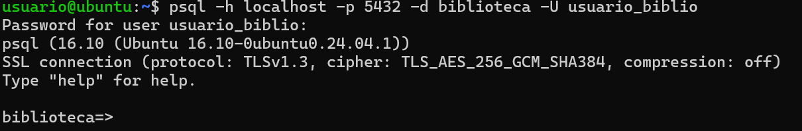

# Practica-1-ADBD
### Autores: Eric Bermúdez Hernández
###          Alba Pérez Rodríguez


## Índice
1. [Introducción](#introducción)  
2. [Creación de la Base de Datos](#creación-de-la-base-de-datos)  
3. [Gestión de Usuarios y Roles](#gestión-de-usuarios-y-roles)  
   - [Creación de usuarios](#creación-de-usuarios)  
   - [Creación de roles](#creación-de-roles)  
   - [Asignación de roles](#asignación-de-roles)  
   - [Consulta de usuarios](#consulta-de-usuarios)  
   - [Cambio de contraseña](#cambio-de-contraseña)  
   - [Restricciones de permisos](#restricciones-de-permisos)  
4. [Creación de Tablas](#creación-de-tablas)  

---

## 1. Introducción


---


## 2. Creación de la Base de Datos

``` sql
create database biblioteca;
``` 


---


## 3. Gestión de Usuarios y Roles

### Creación de usuarios
- Crear un usuario **admin_biblio** con permisos de administrador sobre la base de datos.  


- Crear un usuario **usuario_biblio** con permisos solo de lectura.  
*ERIC:*
```sql
CREATE USER usuario_biblio;
GRANT USAGE ON SCHEMA public TO usuario_biblio;
ALTER DEFAULT PRIVILEGES IN SCHEMA public
GRANT SELECT ON TABLES TO usuario_biblio;
``` 

**Captura de demostración que el usuario_biblio solo tiene permisos de lectura:**


**Explicación:**
Según la consulta realizada en la vista information_schema.role_table_grants, el usuario usuario_biblio no presenta ningún privilegio asignado sobre las tablas de la base de datos. Esto significa que actualmente no puede ejecutar operaciones de lectura ni de escritura. Por tanto, no se le pueden atribuir permisos de solo lectura, ya que en realidad no dispone de acceso alguno a los objetos de la base de datos.


### Creación de roles
- Crear un rol llamado **lectores** con permisos únicamente de consulta sobre todas las tablas de la base de datos.  

```sql

CREATE ROLE lectores;
GRANT CONNECT ON DATABASE biblioteca TO lectores;
GRANT USAGE ON SCHEMA public TO lectores;
GRANT SELECT ON ALL TABLES IN SCHEMA public TO lectores;
ALTER DEFAULT PRIVILEGES IN SCHEMA public GRANT SELECT ON TABLES TO lectores;

```


### Asignación de roles
- Asignar el usuario **usuario_biblio** al rol **lectores**.  

```sql
GRANT lectores TO usuario_biblio;
```


### Consulta de usuarios
- Consultar las tablas del sistema para listar todos los usuarios creados (`pg_roles`).  

```sql
SELECT *
FROM pg_roles;

```


### Cambio de contraseña
- Cambiar la contraseña del usuario **usuario_biblio**.  

```sql
ALTER USER usuario_biblio WITH PASSWORD '1234';

```



### Restricciones de permisos
- Configurar permisos de tal forma que el usuario **usuario_biblio** no pueda eliminar registros en ninguna tabla.  

El usuario usuario_biblio ha sido configurado con permisos exclusivamente de lectura sobre la base de datos biblioteca. Esto se logró concediéndole la capacidad de conectarse a la base de datos, de acceder al esquema público donde se encuentran las tablas y de ejecutar únicamente consultas de tipo SELECT sobre todas las tablas existentes. Además, se configuró de manera que cualquier tabla que se cree en el futuro también le permita únicamente la lectura de datos. Como resultado, usuario_biblio puede consultar toda la información de la base de datos, pero cualquier intento de modificar, insertar o eliminar registros será denegado automáticamente, garantizando que este usuario cumpla estrictamente con la restricción de no poder eliminar registros en ninguna tabla.

---

## 4. Creación de Tablas
- Crear la tabla **autores** con los campos:  
  - `id_autor` (clave primaria)  
  - `nombre`  
  - `nacionalidad`  

```sql
CREATE TABLE autores (
    id_autor SERIAL PRIMARY KEY,
    nombre VARCHAR(100) NOT NULL,
    nacionalidad VARCHAR(50)
);
```

**Comprobación de que la tabla se ha creado correctamente:**


- Crear la tabla **libros** con los campos:  
  - `id_libro` (clave primaria)  
  - `titulo`  
  - `año_publicacion`  
  - `id_autor` (clave foránea hacia `autores`)  

```sql
CREATE TABLE libros (
    id_libro SERIAL PRIMARY KEY,
    titulo VARCHAR(200) NOT NULL,
    año_publicacion INT,
    id_autor INT NOT NULL,
    CONSTRAINT fk_autor FOREIGN KEY (id_autor) REFERENCES autores(id_autor)
);
```

**Comprobación de que la tabla se ha creado correctamente:**


 Crear la tabla **prestamos** con los campos:  
  - `id_prestamo` (clave primaria)  
  - `id_libro` (clave foránea hacia `libros`)  
  - `fecha_prestamo`  
  - `fecha_devolucion`  
  - `usuario_prestatario`  

```sql
CREATE TABLE prestamos (
    id_prestamo SERIAL PRIMARY KEY,
    id_libro INT NOT NULL,
    fecha_prestamo DATE NOT NULL,
    fecha_devolucion DATE,
    usuario_prestatario VARCHAR(100) NOT NULL,
    CONSTRAINT fk_libro FOREIGN KEY (id_libro) REFERENCES libros(id_libro)
);
```

**Comprobación de que la tabla se ha creado correctamente:**


--- 

## 5. Inserción de Datos

### Autores (5 ejemplos)
Insertar los autores en la tabla **autores**:

```sql
INSERT INTO autores (nombre, nacionalidad) VALUES
('Gabriel García Márquez', 'Colombiana'),
('J.K. Rowling', 'Británica'),
('Isabel Allende', 'Chilena'),
('George Orwell', 'Británico'),
('Mario Vargas Llosa', 'Peruano');

```


###  Libros.

```sql
INSERT INTO libros (titulo, año_publicacion, id_autor) VALUES
('Cien Años de Soledad', 1967, 1),
('Harry Potter y la Piedra Filosofal', 1997, 2),
('Harry Potter y la Cámara Secreta', 1998, 2),
('La Casa de los Espíritus', 1982, 3),
('1984', 1949, 4),
('Rebelión en la Granja', 1945, 4),
('La Ciudad y los Perros', 1963, 5),
('Conversación en La Catedral', 1969, 5);

```
### Préstamos.

```sql
INSERT INTO prestamos (id_libro, fecha_prestamo, fecha_devolucion, usuario_prestatario) VALUES
(1, '2025-09-01', '2025-09-10', 'Juan Pérez'),
(2, '2025-09-03', '2025-09-15', 'María López'),
(4, '2025-09-05', NULL, 'Carlos García'),
(5, '2025-09-07', '2025-09-12', 'Ana Torres'),
(7, '2025-09-09', NULL, 'Luis Fernández');

```
---

## 6. Consultas Básicas

- Listar todos los libros con su autor correspondiente.  
- Mostrar los préstamos que aún no tienen fecha de devolución.  
- Obtener los autores que tienen más de un libro registrado.


---

## 7. Consultas con Agregación

- Calcular el número total de préstamos realizados.  
- Obtener el número de libros prestados por cada usuario.

--- 


## 8. Modificación de Datos

- Actualizar la fecha de devolución de un préstamo pendiente.  
- Eliminar un libro y comprobar el efecto en la tabla de préstamos (usar ON DELETE CASCADE o justificar el comportamiento).

---


## 9. Creación de Vistas

- Crear una vista llamada `vista_libros_prestados` que muestre: título del libro, autor y nombre del prestatario.  
- Conceder permisos de consulta sobre esta vista únicamente a `usuario_biblio`.

---

## 10. Funciones y Consultas Avanzadas

- Crear una función que reciba el nombre de un autor y devuelva todos los libros escritos por él.  
- Crear una consulta que devuelva los tres libros más prestados.

---

## 11. Exportación e Importación de Datos

- Exportar el contenido de la tabla `libros` a un archivo CSV.  
- Importar datos adicionales de autores desde un archivo CSV externo.

---