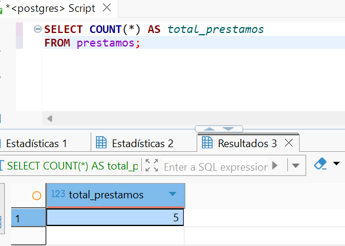

# **Práctica 1 - ADBD**
### **Administración de Bases de Datos**

---

## **Autores**
- **Eric Bermúdez Hernández**  
- **Alba Pérez Rodríguez**

## Índice
1. [Introducción](#introducción)  
2. [Creación de la Base de Datos](#creación-de-la-base-de-datos)  
3. [Gestión de Usuarios y Roles](#gestión-de-usuarios-y-roles)  
   - [Creación de usuarios](#creación-de-usuarios)  
   - [Creación de roles](#creación-de-roles)  
   - [Asignación de roles](#asignación-de-roles)  
   - [Consulta de usuarios](#consulta-de-usuarios)  
   - [Cambio de contraseña](#cambio-de-contraseña)  
   - [Restricciones de permisos](#restricciones-de-permisos)  
4. [Creación de Tablas](#creación-de-tablas)  
   - [Tabla autores](#tabla-autores)  
   - [Tabla libros](#tabla-libros)  
   - [Tabla préstamos](#tabla-préstamos)  
5. [Inserción de Datos](#inserción-de-datos)  
   - [Autores](#autores-5-ejemplos)  
   - [Libros](#libros)  
   - [Préstamos](#préstamos)  
6. [Consultas Básicas](#consultas-básicas)  
   - [Listar libros con sus autores](#listar-todos-los-libros-con-su-autor-correspondiente)  
   - [Préstamos pendientes](#mostrar-los-préstamos-que-aún-no-tienen-fecha-de-devolución)  
   - [Autores con más de un libro](#obtener-los-autores-que-tienen-más-de-un-libro-registrado)  
7. [Consultas con Agregación](#consultas-con-agregación)  
   - [Número total de préstamos](#calcular-el-número-total-de-préstamos-realizados)  
   - [Libros prestados por usuario](#obtener-el-número-de-libros-prestados-por-cada-usuario)  
8. [Modificación de Datos](#modificación-de-datos)  
   - [Actualizar fecha de devolución](#actualizar-la-fecha-de-devolución-de-un-préstamo-pendiente)  
   - [Eliminar libro y efecto en préstamos](#elimin)

---

## 1. Introducción
En esta práctica comprenderemos y aplicaremos las operaciones fundamentales de administración y manejo de datos en PostgreSQL, incluyendo la creación de usuarios, tablas, vistas y funciones. Además, desarrollaremos nuestras habilidades en la elaboración de consultas SQL básicas y avanzadas, aplicando criterios de filtrado, agregación y relaciones entre tablas en un contexto realista.

---

## 2. Creación de la Base de Datos
Para comenzar con la práctica, se procede a crear la base de datos que almacenará toda la información de la biblioteca. La consulta SQL utilizada es la siguiente:

``` sql
create database biblioteca;
``` 
Esta consulta crea una base de datos llamada `biblioteca` que servirá como contenedor principal para todas las tablas y datos relacionados con la gestión de autores, libros y préstamos. Esto permite organizar la información de manera centralizada y controlada dentro del sistema PostgreSQL.

---

## 3. Gestión de Usuarios y Roles

### Creación de usuarios
- Crear un usuario **admin_biblio** con permisos de administrador sobre la base de datos.  

La consulta SQL para realizar la tarea es la siguiente:
```sql
create user admin_biblio with superuser
```


Como se aprecia en la imagen, se crea el usuario admin_biblio y este tiene los permisos de superusuario marcados en la tabla con la `[V]`. Esto significa que puede administrar completamente la base de datos `biblioteca`, incluyendo la creación de tablas, gestión de roles, usuarios, y ejecución de cualquier operación sobre los datos.

- Crear un usuario **usuario_biblio** con permisos solo de lectura. 

La consulta SQL utilizada es la siguiente:
```sql
CREATE USER usuario_biblio;
GRANT USAGE ON SCHEMA public TO usuario_biblio;
ALTER DEFAULT PRIVILEGES IN SCHEMA public
GRANT SELECT ON TABLES TO usuario_biblio;
``` 

Captura de demostración que el usuario_biblio solo tiene permisos de lectura:


Como se puede ver, según la consulta realizada en la vista information_schema.role_table_grants, el usuario usuario_biblio no presenta ningún privilegio asignado sobre las tablas existentes de la base de datos. Esto significa que actualmente no puede ejecutar operaciones de lectura ni de escritura sobre esas tablas.

### Creación de roles
- Crear un rol llamado **lectores** con permisos únicamente de consulta sobre todas las tablas de la base de datos.  

Consulta SQL:
```sql
CREATE ROLE lectores;
GRANT CONNECT ON DATABASE biblioteca TO lectores;
GRANT USAGE ON SCHEMA public TO lectores;
GRANT SELECT ON ALL TABLES IN SCHEMA public TO lectores;
ALTER DEFAULT PRIVILEGES IN SCHEMA public GRANT SELECT ON TABLES TO lectores;
```

Los comandos permiten crear un rol llamado `lectores` y configurarlo con permisos únicamente de consulta sobre todas las tablas de la base de datos `biblioteca`. Primero, `CREATE ROLE lectores` crea el rol. Luego, `GRANT CONNECT ON DATABASE biblioteca TO lectores` permite que el rol se conecte a la base de datos, y `GRANT USAGE ON SCHEMA public TO lectores` le da acceso al esquema público. A continuación, `GRANT SELECT ON ALL TABLES IN SCHEMA public TO lectores` concede permisos de solo lectura sobre todas las tablas existentes, y `ALTER DEFAULT PRIVILEGES IN SCHEMA public GRANT SELECT ON TABLES TO lectores` asegura que cualquier tabla creada en el futuro también sea accesible únicamente en modo lectura para los miembros de este rol.

Como vemos en la siguiente captura, si leemos el contenido de la tabla **pg_roles**, podemos ver que el rol se ha añadido correctamente y que este no tiene ningún permiso:


### Asignación de roles
- Asignar el usuario **usuario_biblio** al rol **lectores**.  

Consulta SQL:
```sql
GRANT lectores TO usuario_biblio;
```

Con este comando se asigna el rol `lectores` al usuario `usuario_biblio`, lo que permite que herede automáticamente los permisos de solo lectura definidos para el rol. De esta manera, `usuario_biblio` podrá consultar todas las tablas actuales y futuras del esquema público sin tener privilegios de modificación.


En la captura anterior, podemos apreciar como el usuario **usuario_biblio** tiene asignado el rol **lectores**


### Consulta de usuarios
- Consultar las tablas del sistema para listar todos los usuarios creados (`pg_roles`).  

Consulta SQL:
```sql
SELECT *
FROM pg_roles;
```
La tabla del sistema `pg_roles` contiene información sobre todos los roles y usuarios creados en PostgreSQL. Ejecutando esta consulta se obtiene un listado completo de los usuarios, sus privilegios, roles asignados y propiedades como superusuario, creación de bases de datos y permisos de conexión.

En la imagen se puede comprobar que al aplicar la consulta, podemos consultar todos los usuarios creados en el sistema


### Cambio de contraseña
- Cambiar la contraseña del usuario **usuario_biblio**.  

Consulta:
```sql
ALTER USER usuario_biblio WITH PASSWORD '1234';
```
El comando `ALTER USER` permite modificar las propiedades de un usuario en PostgreSQL. En este caso, se cambia la contraseña de `usuario_biblio` a `'1234'`, asegurando que el usuario pueda autenticarse con la nueva contraseña para acceder a la base de datos.

### Restricciones de permisos
- Configurar permisos de tal forma que el usuario **usuario_biblio** no pueda eliminar registros en ninguna tabla.  

Como comprobamos anteriormente, el usuario usuario_biblio ha sido configurado con permisos exclusivamente de lectura sobre la base de datos biblioteca. Esto se logró concediéndole la capacidad de conectarse a la base de datos, de acceder al esquema público donde se encuentran las tablas y de ejecutar únicamente consultas de tipo SELECT sobre todas las tablas existentes. Además, se configuró de manera que cualquier tabla que se cree en el futuro también le permita únicamente la lectura de datos. Como resultado, usuario_biblio puede consultar toda la información de la base de datos, pero cualquier intento de modificar, insertar o eliminar registros será denegado automáticamente, garantizando que este usuario cumpla estrictamente con la restricción de no poder eliminar registros en ninguna tabla.

---

## 4. Creación de Tablas
- Crear la tabla **autores** con los campos:  
  - `id_autor` (clave primaria)  
  - `nombre`  
  - `nacionalidad`  

Creamos la tabla autores mediante la siguiente consulta SQL:
```sql
CREATE TABLE autores (
    id_autor SERIAL PRIMARY KEY,
    nombre VARCHAR(100) NOT NULL,
    nacionalidad VARCHAR(50)
);
```

Se crea la tabla `autores` para almacenar información de los autores de los libros.  
- `id_autor` es un campo autoincremental (`SERIAL`) que sirve como clave primaria, garantizando la unicidad de cada autor.  
- `nombre` es obligatorio (`NOT NULL`) y almacena el nombre del autor con una longitud máxima de 100 caracteres.  
- `nacionalidad` almacena la nacionalidad del autor y es opcional.  
Esta tabla servirá como referencia para establecer relaciones con la tabla `libros`.

Comprobación de que la tabla se ha creado correctamente:


Como vemos la tabla se ha creado correctamente con sus atributos definidos en la consulta

- Crear la tabla **libros** con los campos:  
  - `id_libro` (clave primaria)  
  - `titulo`  
  - `año_publicacion`  
  - `id_autor` (clave foránea hacia `autores`)  

```sql
CREATE TABLE libros (
    id_libro SERIAL PRIMARY KEY,
    titulo VARCHAR(200) NOT NULL,
    año_publicacion INT,
    id_autor INT NOT NULL,
    CONSTRAINT fk_autor FOREIGN KEY (id_autor) REFERENCES autores(id_autor)
);
```

La tabla `libros` almacena información sobre los libros de la biblioteca.  
- `id_libro` es la clave primaria y se autoincrementa automáticamente (`SERIAL`).  
- `titulo` almacena el nombre del libro con un tamaño máximo de 200 caracteres y es obligatorio (`NOT NULL`).  
- `año_publicacion` indica el año en que se publicó el libro.  
- `id_autor` establece una relación con la tabla `autores` mediante la clave foránea `fk_autor`, garantizando la integridad referencial y permitiendo asociar cada libro con su autor correspondiente.

Comprobación de que la tabla se ha creado correctamente:


Como vemos la tabla se ha creado correctamente con sus atributos definidos en la consulta

- Crear la tabla **prestamos** con los campos:  
  - `id_prestamo` (clave primaria)  
  - `id_libro` (clave foránea hacia `libros`)  
  - `fecha_prestamo`  
  - `fecha_devolucion`  
  - `usuario_prestatario`  

```sql
CREATE TABLE prestamos (
    id_prestamo SERIAL PRIMARY KEY,
    id_libro INT NOT NULL,
    fecha_prestamo DATE NOT NULL,
    fecha_devolucion DATE,
    usuario_prestatario VARCHAR(100) NOT NULL,
    CONSTRAINT fk_libro FOREIGN KEY (id_libro) REFERENCES libros(id_libro)
);
```

La tabla `prestamos` registra los préstamos de libros realizados en la biblioteca.  
- `id_prestamo` es la clave primaria autoincremental.  
- `id_libro` referencia a la tabla `libros` mediante esta clave foránea `fk_libro`, asegurando que cada préstamo esté asociado a un libro existente.  
- `fecha_prestamo` almacena la fecha en que se realizó el préstamo y es obligatorio.  
- `fecha_devolucion` indica la fecha en que el libro fue devuelto, y puede quedar vacía si aún no se ha devuelto.  
- `usuario_prestatario` almacena el nombre del usuario que realizó el préstamo y es obligatorio.  
Esta estructura permite llevar un control detallado de los préstamos de la biblioteca.

Comprobación de que la tabla se ha creado correctamente:


--- 

## 5. Inserción de Datos

### Autores (5 ejemplos)
Insertar los autores en la tabla **autores**:

```sql
INSERT INTO autores (nombre, nacionalidad) VALUES
('Gabriel García Márquez', 'Colombiana'),
('J.K. Rowling', 'Británica'),
('Isabel Allende', 'Chilena'),
('George Orwell', 'Británico'),
('Mario Vargas Llosa', 'Peruano');
```

Se insertan cinco autores en la tabla `autores` con sus respectivos nombres y nacionalidades.  
Esto permite tener datos de ejemplo que se relacionarán posteriormente con la tabla `libros`, asegurando que cada libro pueda asociarse con un autor válido mediante la clave foránea `id_autor`.


Con la siguiente imagen podemos comprobar que los autores se han introducido correctamente en la tabla autores.
###  Libros.

```sql
INSERT INTO libros (titulo, año_publicacion, id_autor) VALUES
('Cien Años de Soledad', 1967, 1),
('Harry Potter y la Piedra Filosofal', 1997, 2),
('Harry Potter y la Cámara Secreta', 1998, 2),
('La Casa de los Espíritus', 1982, 3),
('1984', 1949, 4),
('Rebelión en la Granja', 1945, 4),
('La Ciudad y los Perros', 1963, 5),
('Conversación en La Catedral', 1969, 5);
```

Se insertan ocho libros en la tabla `libros`, indicando el título, el año de publicación y el `id_autor` correspondiente de la tabla `autores`.  
Esto establece la relación entre cada libro y su autor mediante la clave foránea `id_autor`, garantizando la integridad referencial en la base de datos.


### Préstamos.

```sql
INSERT INTO prestamos (id_libro, fecha_prestamo, fecha_devolucion, usuario_prestatario) VALUES
(1, '2025-09-01', '2025-09-10', 'Juan Pérez'),
(2, '2025-09-03', '2025-09-15', 'María López'),
(4, '2025-09-05', NULL, 'Carlos García'),
(5, '2025-09-07', '2025-09-12', 'Ana Torres'),
(7, '2025-09-09', NULL, 'Luis Fernández');
```

Se registran cinco préstamos en la tabla `prestamos`, indicando el libro prestado (`id_libro`), la fecha de préstamo, la fecha de devolución (puede ser NULL si aún no se ha devuelto) y el usuario prestatario.  
Esto permite simular la actividad de préstamos de la biblioteca y proporciona datos para consultas posteriores sobre libros prestados y usuarios.


---

## 6. Consultas Básicas

- Listar todos los libros con su autor correspondiente.  
```sql
select libros.titulo, autores.nombre
from libros, autores
where libros.id_autor = autores.id_autor;
```


Esta consulta une las tablas `libros` y `autores` mediante la clave foránea `id_autor`.  
Se obtiene una lista de todos los libros junto con el nombre del autor correspondiente, permitiendo visualizar fácilmente qué autor escribió cada libro.

- Mostrar los préstamos que aún no tienen fecha de devolución.  

```sql
SELECT prestamos.id_prestamo, libros.titulo, prestamos.usuario_prestatario
FROM prestamos, libros
WHERE prestamos.id_libro = libros.id_libro
AND prestamos.fecha_devolucion IS NULL;
```
Esta consulta muestra todos los préstamos que aún no han sido devueltos.  
Se realiza una unión entre `prestamos` y `libros` mediante `id_libro` y se filtran los registros cuya columna `fecha_devolucion` es `NULL`.  
De esta manera, se puede identificar fácilmente qué libros están actualmente prestados y a quién.

En la siguiente imagen se muestra el contenido de la tabla prestamos en la que hay dos fechas de devolución sin definir y que por tanto tienen como valor NULL


En la siguiente imagen se muestra el resultado de la consulta, mostrandose los dos prestamos sin fecha de devolución


- Obtener los autores que tienen más de un libro registrado.

```sql
SELECT autores.nombre, COUNT(libros.id_libro) AS total_libros
FROM autores, libros
WHERE autores.id_autor = libros.id_autor
GROUP BY autores.nombre
HAVING COUNT(libros.id_libro) > 1;
```
Esta consulta agrupa los libros por autor utilizando `GROUP BY` y cuenta cuántos libros tiene cada uno con `COUNT(libros.id_libro)`.  
Luego, `HAVING COUNT(libros.id_libro) > 1` filtra los resultados para mostrar únicamente aquellos autores que tienen más de un libro registrado en la base de datos.

En la siguiente captura se muestra el contenido de la tabla libros:


Resultado de la consulta:


---

## 7. Consultas con Agregación

- Calcular el número total de préstamos realizados.  
```sql
SELECT COUNT(*) AS total_prestamos
FROM prestamos;
```

En la siguiente imagen se muestra el contenido de la tabla prestamos:


Resultado de la consulta, como se ve, se han contado todos los prestamos:


Esta consulta utiliza la función de agregación `COUNT(*)` para contar todos los registros de la tabla `prestamos`.  
El resultado indica el número total de préstamos realizados en la biblioteca, proporcionando una visión general de la actividad de préstamos.

- Obtener el número de libros prestados por cada usuario.
```sql
SELECT usuario_prestatario, COUNT(*) AS total_libros_prestados
FROM prestamos
GROUP BY usuario_prestatario;
```
Esta consulta agrupa los registros de la tabla `prestamos` por `usuario_prestatario` y utiliza `COUNT(*)` para contar cuántos libros ha prestado cada usuario.  
El resultado muestra, de manera clara, el total de préstamos asociados a cada usuario registrado en la biblioteca.

Resultado de la consulta:


--- 

## 8. Modificación de Datos

- Actualizar la fecha de devolución de un préstamo pendiente.  

```sql
UPDATE prestamos
SET fecha_devolucion = '2025-09-20'
WHERE id_prestamo = 3;
```
Esta consulta actualiza el registro del préstamo con `id_prestamo = 3` en la tabla `prestamos`, asignando la fecha de devolución `'2025-09-20'`.  
Esto permite marcar que un libro previamente pendiente ha sido devuelto, manteniendo la información de los préstamos al día.

En la siguiente imagen se muestra el número de prestamos pendientes, los cuales son 2, los que tienen como valor NULL en la fecha_devolucion


Tabla después de realizar el cambio indicado en la consulta:


- Eliminar un libro y comprobar el efecto en la tabla de préstamos (usar ON DELETE CASCADE o justificar el comportamiento).

```sql
DELETE FROM prestamos
WHERE id_libro = 5;

DELETE FROM libros
WHERE id_libro = 5;

ALTER TABLE prestamos DROP CONSTRAINT prestamos_id_libro_fkey;

ALTER TABLE prestamos
ADD CONSTRAINT prestamos_id_libro_fkey
FOREIGN KEY (id_libro) REFERENCES libros(id_libro)
ON DELETE CASCADE;
```

En la consulta anterior, primero se eliminan los registros de préstamos asociados al libro con **id_libro = 5**. Luego se borra el libro de la tabla **libros**.  
A continuación, se modifica la clave foránea **prestamos_id_libro_fkey** para incluir la opción **ON DELETE CASCADE**, de manera que cualquier eliminación futura de un libro elimine automáticamente los préstamos asociados.  
Finalmente, se verifica con un **SELECT** que no quedan registros de préstamos relacionados con el libro eliminado.

Comprobamos con **SELECT * FROM prestamos WHERE id_libro = 5;** que se ha eliminado el libro


Como podemos comprobar con las dos consultas que se muestran en las imágenes, se ha borrado correctamente el libro con id = 5, ya que no aparece en ninguna tabla resultado.

---

## 9. Creación de Vistas

- Crear una vista llamada `vista_libros_prestados` que muestre: título del libro, autor y nombre del prestatario.  

```sql
CREATE VIEW vista_libros_prestados AS
SELECT l.titulo, a.nombre AS autor, p.usuario_prestatario
FROM libros l
JOIN autores a ON l.id_autor = a.id_autor
JOIN prestamos p ON l.id_libro = p.id_libro;
```

Como vemos en la siguiente imagen, la vista se ha creado correctamente:


La vista `vista_libros_prestados` combina la información de las tablas `libros`, `autores` y `prestamos`.  
Se utiliza `JOIN` para relacionar cada libro con su autor y con el usuario que lo ha prestado.  
El resultado muestra de manera resumida y conveniente el título del libro, el nombre del autor y el usuario que lo tiene en préstamo, sin necesidad de escribir la consulta completa cada vez.

- Conceder permisos de consulta sobre esta vista únicamente a `usuario_biblio`.
```sql
GRANT SELECT ON vista_libros_prestados TO usuario_biblio;
```


Este comando otorga a `usuario_biblio` permisos de solo lectura (`SELECT`) sobre la vista `vista_libros_prestados`.  
De esta manera, el usuario puede consultar la información de libros prestados sin poder modificar la vista ni las tablas subyacentes, respetando los principios de seguridad y control de acceso.

---

## 10. Funciones y Consultas Avanzadas

- Crear una función que reciba el nombre de un autor y devuelva todos los libros escritos por él.  
```sql
CREATE OR REPLACE FUNCTION libros_por_autor(nombre_autor VARCHAR)
RETURNS TABLE(titulo_libro VARCHAR, año_publicacion INT) AS $$
BEGIN
    RETURN QUERY
    SELECT l.titulo, l.año_publicacion
    FROM libros l
    JOIN autores a ON l.id_autor = a.id_autor
    WHERE a.nombre = nombre_autor;
END;
$$ LANGUAGE plpgsql;

```
```sql
SELECT * FROM libros_por_autor('J.K. Rowling');
```

En las siguientes imágenes se comprueba que se ha creado la función correctamente y que esta funciona de la manera esperada:


Se crea una función `libros_por_autor` que recibe como parámetro el nombre de un autor.  
La función realiza un `JOIN` entre las tablas `libros` y `autores` para obtener todos los libros escritos por ese autor, devolviendo el título y el año de publicación.  
Esto permite reutilizar la lógica de consulta sin tener que escribir la misma sentencia SQL cada vez que se quiera obtener los libros de un autor específico.

- Crear una consulta que devuelva los tres libros más prestados.

```sql
SELECT l.titulo, COUNT(p.id_prestamo) AS veces_prestado
FROM libros l
JOIN prestamos p ON l.id_libro = p.id_libro
GROUP BY l.titulo
ORDER BY veces_prestado DESC
LIMIT 3;
```
Añadimos más préstamos para que se vea de manera más clara cuales son los 3 libros más prestados:

```sql
-- Libro 1(Cien Años de Soledad) prestado 5 veces
INSERT INTO prestamos (id_libro, fecha_prestamo, fecha_devolucion, usuario_prestatario) VALUES
(1, '2025-09-01', '2025-09-05', 'Juan Pérez'),
(1, '2025-09-06', '2025-09-10', 'María López'),
(1, '2025-09-11', '2025-09-15', 'Carlos García'),
(1, '2025-09-16', '2025-09-20', 'Ana Torres'),
(1, '2025-09-21', '2025-09-25', 'Luis Fernández');

-- Libro 2(Harry Potter y la Piedra Filosofal) prestado 3 veces
INSERT INTO prestamos (id_libro, fecha_prestamo, fecha_devolucion, usuario_prestatario) VALUES
(2, '2025-09-02', '2025-09-06', 'Juan Pérez'),
(2, '2025-09-07', '2025-09-11', 'María López'),
(2, '2025-09-12', '2025-09-16', 'Carlos García');

-- Libro 3(Harry Potter y la Cámara Secreta) prestado 2 veces
INSERT INTO prestamos (id_libro, fecha_prestamo, fecha_devolucion, usuario_prestatario) VALUES
(3, '2025-09-03', '2025-09-07', 'Ana Torres'),
(3, '2025-09-08', '2025-09-12', 'Luis Fernández');

-- Libro 4(La Casa de los Espíritus) prestado 1 vez
INSERT INTO prestamos (id_libro, fecha_prestamo, fecha_devolucion, usuario_prestatario) VALUES
(4, '2025-09-04', '2025-09-08', 'Juan Pérez');

-- Libro 5(1984) prestado 1 vez
INSERT INTO prestamos (id_libro, fecha_prestamo, fecha_devolucion, usuario_prestatario) VALUES
(5, '2025-09-05', '2025-09-09', 'María López');

```

Resultado de la consulta:


La consulta utiliza `JOIN` entre `libros` y `prestamos`, agrupa por título de libro, cuenta cuántas veces ha sido prestado (`COUNT`) y ordena los resultados en orden descendente (`ORDER BY`).  
Finalmente, `LIMIT 3` devuelve solo los tres libros con mayor número de préstamos.

---

## 11. Exportación e Importación de Datos

- Exportar el contenido de la tabla `libros` a un archivo CSV.  

Con el siguiente comando en la consola plsql, exportamos la tabla libros como un archivo CSV
```sql
\copy libros TO '/tmp/libros.csv' CSV HEADER;
```
El comando `\copy` de PostgreSQL permite exportar los datos de una tabla a un archivo CSV desde el cliente, sin necesidad de privilegios de superusuario.  
La opción `CSV HEADER` incluye los nombres de las columnas en la primera fila del archivo, facilitando su lectura en otras aplicaciones como Excel o programas de análisis de datos.

En las siguientes imágenes se puede comprobar que la tabla libros se ha exportado correctamente:


- Importar datos adicionales de autores desde un archivo CSV externo.

Creamos un archivo .csv denominado autores.csv e incluimos lo siguiente:
nombre,nacionalidad
Leo Tolstoy,Rusa
Jane Austen,Británica
Homer,Griega

Importaremos los datos adicionales de autores mediante el siguiente comando en una consola plsql:
```sql
postgres=# \copy autores(nombre, nacionalidad)
FROM '/tmp/autores.csv' CSV HEADER;
```
El comando `\copy` permite importar datos desde un archivo CSV al cliente PostgreSQL.  
Se especifican las columnas de destino (`nombre` y `nacionalidad`) y se indica que el archivo incluye una fila de encabezado (`CSV HEADER`).  
Esto agrega los autores del archivo externo a la tabla `autores` de manera rápida y sencilla.


En la siguiente imagen se ve como se han añadido los autores del archivo autores.csv a la tabla autores


---
