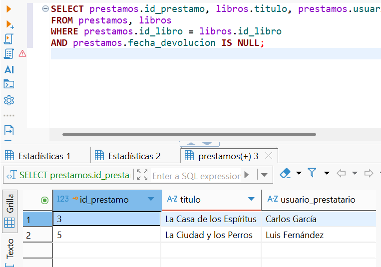
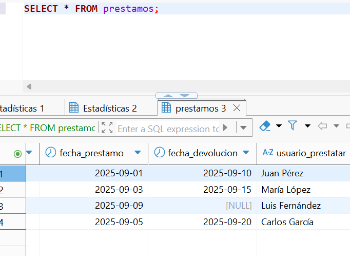

# Practica-1-ADBD
### Autores: Eric Bermúdez Hernández
###          Alba Pérez Rodríguez


## Índice
1. [Introducción](#introducción)  
2. [Creación de la Base de Datos](#creación-de-la-base-de-datos)  
3. [Gestión de Usuarios y Roles](#gestión-de-usuarios-y-roles)  
   - [Creación de usuarios](#creación-de-usuarios)  
   - [Creación de roles](#creación-de-roles)  
   - [Asignación de roles](#asignación-de-roles)  
   - [Consulta de usuarios](#consulta-de-usuarios)  
   - [Cambio de contraseña](#cambio-de-contraseña)  
   - [Restricciones de permisos](#restricciones-de-permisos)  
4. [Creación de Tablas](#creación-de-tablas)  

---

## 1. Introducción
En esta práctica comprenderemos y aplicaremos las operaciones fundamentales de administración y manejo de datos en PostgreSQL, incluyendo la creación de usuarios, tablas, vistas y funciones. Además, desarrollaremos nuestras habilidades en la elaboración de consultas SQL básicas y avanzadas, aplicando criterios de filtrado, agregación y relaciones entre tablas en un contexto realista.

---


## 2. Creación de la Base de Datos

``` sql
create database biblioteca;
``` 


---


## 3. Gestión de Usuarios y Roles

### Creación de usuarios
- Crear un usuario **admin_biblio** con permisos de administrador sobre la base de datos.  


- Crear un usuario **usuario_biblio** con permisos solo de lectura.  
```sql
CREATE USER usuario_biblio;
GRANT USAGE ON SCHEMA public TO usuario_biblio;
ALTER DEFAULT PRIVILEGES IN SCHEMA public
GRANT SELECT ON TABLES TO usuario_biblio;
``` 

**Captura de demostración que el usuario_biblio solo tiene permisos de lectura:**


**Explicación:**
Según la consulta realizada en la vista information_schema.role_table_grants, el usuario usuario_biblio no presenta ningún privilegio asignado sobre las tablas de la base de datos. Esto significa que actualmente no puede ejecutar operaciones de lectura ni de escritura. Por tanto, no se le pueden atribuir permisos de solo lectura, ya que en realidad no dispone de acceso alguno a los objetos de la base de datos.


### Creación de roles
- Crear un rol llamado **lectores** con permisos únicamente de consulta sobre todas las tablas de la base de datos.  

```sql

CREATE ROLE lectores;
GRANT CONNECT ON DATABASE biblioteca TO lectores;
GRANT USAGE ON SCHEMA public TO lectores;
GRANT SELECT ON ALL TABLES IN SCHEMA public TO lectores;
ALTER DEFAULT PRIVILEGES IN SCHEMA public GRANT SELECT ON TABLES TO lectores;

```


### Asignación de roles
- Asignar el usuario **usuario_biblio** al rol **lectores**.  

```sql
GRANT lectores TO usuario_biblio;
```


### Consulta de usuarios
- Consultar las tablas del sistema para listar todos los usuarios creados (`pg_roles`).  

```sql
SELECT *
FROM pg_roles;

```


### Cambio de contraseña
- Cambiar la contraseña del usuario **usuario_biblio**.  

```sql
ALTER USER usuario_biblio WITH PASSWORD '1234';

```


### Restricciones de permisos
- Configurar permisos de tal forma que el usuario **usuario_biblio** no pueda eliminar registros en ninguna tabla.  

El usuario usuario_biblio ha sido configurado con permisos exclusivamente de lectura sobre la base de datos biblioteca. Esto se logró concediéndole la capacidad de conectarse a la base de datos, de acceder al esquema público donde se encuentran las tablas y de ejecutar únicamente consultas de tipo SELECT sobre todas las tablas existentes. Además, se configuró de manera que cualquier tabla que se cree en el futuro también le permita únicamente la lectura de datos. Como resultado, usuario_biblio puede consultar toda la información de la base de datos, pero cualquier intento de modificar, insertar o eliminar registros será denegado automáticamente, garantizando que este usuario cumpla estrictamente con la restricción de no poder eliminar registros en ninguna tabla.

---

## 4. Creación de Tablas
- Crear la tabla **autores** con los campos:  
  - `id_autor` (clave primaria)  
  - `nombre`  
  - `nacionalidad`  

```sql
CREATE TABLE autores (
    id_autor SERIAL PRIMARY KEY,
    nombre VARCHAR(100) NOT NULL,
    nacionalidad VARCHAR(50)
);
```

**Comprobación de que la tabla se ha creado correctamente:**


- Crear la tabla **libros** con los campos:  
  - `id_libro` (clave primaria)  
  - `titulo`  
  - `año_publicacion`  
  - `id_autor` (clave foránea hacia `autores`)  

```sql
CREATE TABLE libros (
    id_libro SERIAL PRIMARY KEY,
    titulo VARCHAR(200) NOT NULL,
    año_publicacion INT,
    id_autor INT NOT NULL,
    CONSTRAINT fk_autor FOREIGN KEY (id_autor) REFERENCES autores(id_autor)
);
```

**Comprobación de que la tabla se ha creado correctamente:**


 Crear la tabla **prestamos** con los campos:  
  - `id_prestamo` (clave primaria)  
  - `id_libro` (clave foránea hacia `libros`)  
  - `fecha_prestamo`  
  - `fecha_devolucion`  
  - `usuario_prestatario`  

```sql
CREATE TABLE prestamos (
    id_prestamo SERIAL PRIMARY KEY,
    id_libro INT NOT NULL,
    fecha_prestamo DATE NOT NULL,
    fecha_devolucion DATE,
    usuario_prestatario VARCHAR(100) NOT NULL,
    CONSTRAINT fk_libro FOREIGN KEY (id_libro) REFERENCES libros(id_libro)
);
```

**Comprobación de que la tabla se ha creado correctamente:**


--- 

## 5. Inserción de Datos

### Autores (5 ejemplos)
Insertar los autores en la tabla **autores**:

```sql
INSERT INTO autores (nombre, nacionalidad) VALUES
('Gabriel García Márquez', 'Colombiana'),
('J.K. Rowling', 'Británica'),
('Isabel Allende', 'Chilena'),
('George Orwell', 'Británico'),
('Mario Vargas Llosa', 'Peruano');

```


###  Libros.

```sql
INSERT INTO libros (titulo, año_publicacion, id_autor) VALUES
('Cien Años de Soledad', 1967, 1),
('Harry Potter y la Piedra Filosofal', 1997, 2),
('Harry Potter y la Cámara Secreta', 1998, 2),
('La Casa de los Espíritus', 1982, 3),
('1984', 1949, 4),
('Rebelión en la Granja', 1945, 4),
('La Ciudad y los Perros', 1963, 5),
('Conversación en La Catedral', 1969, 5);

```


### Préstamos.

```sql
INSERT INTO prestamos (id_libro, fecha_prestamo, fecha_devolucion, usuario_prestatario) VALUES
(1, '2025-09-01', '2025-09-10', 'Juan Pérez'),
(2, '2025-09-03', '2025-09-15', 'María López'),
(4, '2025-09-05', NULL, 'Carlos García'),
(5, '2025-09-07', '2025-09-12', 'Ana Torres'),
(7, '2025-09-09', NULL, 'Luis Fernández');

```

---

## 6. Consultas Básicas

- Listar todos los libros con su autor correspondiente.  
```sql
select libros.titulo, autores.nombre
from libros, autores
where libros.id_autor = autores.id_autor;
```


- Mostrar los préstamos que aún no tienen fecha de devolución.  

```sql
SELECT prestamos.id_prestamo, libros.titulo, prestamos.usuario_prestatario
FROM prestamos, libros
WHERE prestamos.id_libro = libros.id_libro
AND prestamos.fecha_devolucion IS NULL;

```



- Obtener los autores que tienen más de un libro registrado.

```sql
SELECT autores.nombre, COUNT(libros.id_libro) AS total_libros
FROM autores, libros
WHERE autores.id_autor = libros.id_autor
GROUP BY autores.nombre
HAVING COUNT(libros.id_libro) > 1;

```


---

## 7. Consultas con Agregación

- Calcular el número total de préstamos realizados.  
```sql
SELECT COUNT(*) AS total_prestamos
FROM prestamos;
```


- Obtener el número de libros prestados por cada usuario.
```sql
SELECT usuario_prestatario, COUNT(*) AS total_libros_prestados
FROM prestamos
GROUP BY usuario_prestatario;

```

--- 


## 8. Modificación de Datos

- Actualizar la fecha de devolución de un préstamo pendiente.  

```sql
UPDATE prestamos
SET fecha_devolucion = '2025-09-20'
WHERE id_prestamo = 3;
```


- Eliminar un libro y comprobar el efecto en la tabla de préstamos (usar ON DELETE CASCADE o justificar el comportamiento).

```sql
DELETE FROM prestamos
WHERE id_libro = 5;

DELETE FROM libros
WHERE id_libro = 5;

ALTER TABLE prestamos DROP CONSTRAINT prestamos_id_libro_fkey;

ALTER TABLE prestamos
ADD CONSTRAINT prestamos_id_libro_fkey
FOREIGN KEY (id_libro) REFERENCES libros(id_libro)
ON DELETE CASCADE;

```
Comporbamos con **SELECT * FROM prestamos WHERE id_libro = 5;**




---

## 9. Creación de Vistas

- Crear una vista llamada `vista_libros_prestados` que muestre: título del libro, autor y nombre del prestatario.  

```sql
CREATE VIEW vista_libros_prestados AS
SELECT l.titulo, a.nombre AS autor, p.usuario_prestatario
FROM libros l
JOIN autores a ON l.id_autor = a.id_autor
JOIN prestamos p ON l.id_libro = p.id_libro;

```


- Conceder permisos de consulta sobre esta vista únicamente a `usuario_biblio`.
```sql
GRANT SELECT ON vista_libros_prestados TO usuario_biblio;
```


---

## 10. Funciones y Consultas Avanzadas

- Crear una función que reciba el nombre de un autor y devuelva todos los libros escritos por él.  
```sql
CREATE OR REPLACE FUNCTION libros_por_autor(nombre_autor VARCHAR)
RETURNS TABLE(titulo_libro VARCHAR, año_publicacion INT) AS $$
BEGIN
    RETURN QUERY
    SELECT l.titulo, l.año_publicacion
    FROM libros l
    JOIN autores a ON l.id_autor = a.id_autor
    WHERE a.nombre = nombre_autor;
END;
$$ LANGUAGE plpgsql;

```
```sql
SELECT * FROM libros_por_autor('J.K. Rowling');
```


- Crear una consulta que devuelva los tres libros más prestados.

```sql
SELECT l.titulo, COUNT(p.id_prestamo) AS veces_prestado
FROM libros l
JOIN prestamos p ON l.id_libro = p.id_libro
GROUP BY l.titulo
ORDER BY veces_prestado DESC
LIMIT 3;
```
Añadimos más préstamos para que se vea de manera más clara cuales son los 3 libros más prestados:

```sql
-- Libro 1(Cien Años de Soledad) prestado 5 veces
INSERT INTO prestamos (id_libro, fecha_prestamo, fecha_devolucion, usuario_prestatario) VALUES
(1, '2025-09-01', '2025-09-05', 'Juan Pérez'),
(1, '2025-09-06', '2025-09-10', 'María López'),
(1, '2025-09-11', '2025-09-15', 'Carlos García'),
(1, '2025-09-16', '2025-09-20', 'Ana Torres'),
(1, '2025-09-21', '2025-09-25', 'Luis Fernández');

-- Libro 2(Harry Potter y la Piedra Filosofal) prestado 3 veces
INSERT INTO prestamos (id_libro, fecha_prestamo, fecha_devolucion, usuario_prestatario) VALUES
(2, '2025-09-02', '2025-09-06', 'Juan Pérez'),
(2, '2025-09-07', '2025-09-11', 'María López'),
(2, '2025-09-12', '2025-09-16', 'Carlos García');

-- Libro 3(Harry Potter y la Cámara Secreta) prestado 2 veces
INSERT INTO prestamos (id_libro, fecha_prestamo, fecha_devolucion, usuario_prestatario) VALUES
(3, '2025-09-03', '2025-09-07', 'Ana Torres'),
(3, '2025-09-08', '2025-09-12', 'Luis Fernández');

-- Libro 4(La Casa de los Espíritus) prestado 1 vez
INSERT INTO prestamos (id_libro, fecha_prestamo, fecha_devolucion, usuario_prestatario) VALUES
(4, '2025-09-04', '2025-09-08', 'Juan Pérez');

-- Libro 5(1984) prestado 1 vez
INSERT INTO prestamos (id_libro, fecha_prestamo, fecha_devolucion, usuario_prestatario) VALUES
(5, '2025-09-05', '2025-09-09', 'María López');

```

---

## 11. Exportación e Importación de Datos

- Exportar el contenido de la tabla `libros` a un archivo CSV.  

```sql
\copy libros TO '/tmp/libros.csv' CSV HEADER;
```


- Importar datos adicionales de autores desde un archivo CSV externo.

Creamos un archivo .csv denominado autores.csv e incluimmos lo siguiente:
nombre,nacionalidad
Leo Tolstoy,Rusa
Jane Austen,Británica
Homer,Griega

```sql
postgres=# \copy autores(nombre, nacionalidad)
FROM '/tmp/autores.csv' CSV HEADER;
```


---